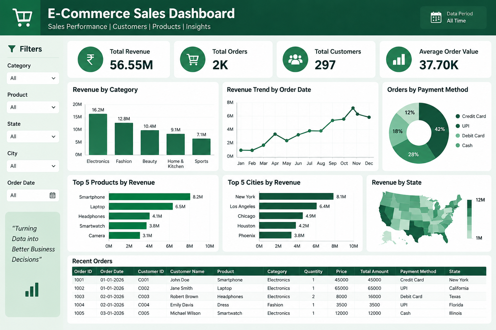

# 🛒 E-Commerce Sales Analysis Dashboard

An interactive **E-Commerce Sales Analysis Dashboard** built using **Power BI** and **PostgreSQL** to analyze revenue, orders, customers, products, and payment performance.

---

## 📊 Dashboard Preview



---

## 🎯 Project Objective

The objective of this project is to analyze e-commerce transaction data and build an interactive Power BI dashboard that provides a clear overview of business performance.

The dashboard helps analyze:

- Total Revenue
- Total Orders
- Total Customers
- Average Order Value
- Product performance
- Category performance
- Customer activity
- Payment information
- Sales trends

---

## 🛠️ Tools & Technologies

- **PostgreSQL** – Database and data storage
- **SQL** – Data querying and analysis
- **Power BI Desktop** – Dashboard development
- **DAX** – Measures and calculations
- **Power Query** – Data transformation
- **GitHub** – Project documentation and version control

---

## 🗂️ Database Tables

The PostgreSQL database contains the following tables:

### 👥 Customers

Contains customer information:

- customer_id
- customer_name
- city
- state
- signup_date

### 🛒 Orders

Contains order transaction information:

- order_id
- customer_id
- order_date
- price
- product_id
- quantity
- status

### 💳 Payments

Contains payment information:

- order_id
- payment_id
- payment_method
- payment_status

### 📦 Products

Contains product information:

- product_id
- product_name
- category
- sub_category

---

## 🔗 Data Model

The Power BI model connects the main tables using relationships between related keys.

```text
Customers
    │
    │ customer_id
    ▼
  Orders
    │
    │ product_id
    ▼
 Products

 Orders
    │
    │ order_id
    ▼
 Payments
